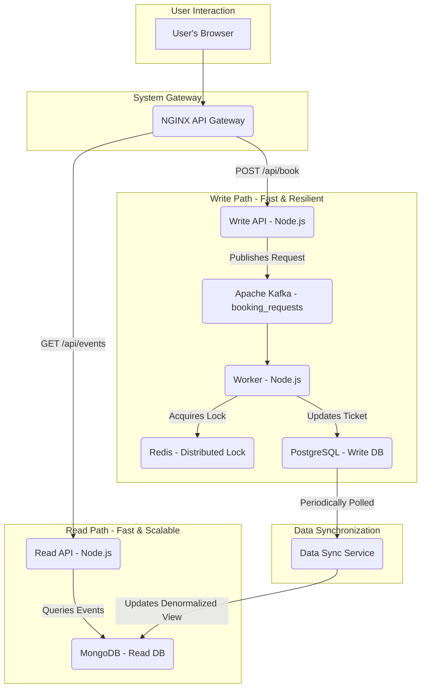

# Distributed Event Booking System

<details>
<summary>Click to see a diagram of the architecture</summary>


</details>

## 🚀 Quick Start

### Prerequisites

- Docker Desktop installed and running
- Git installed
- **No need to install Node.js** - everything runs in containers!

### 1. Clone & Navigate

```bash
git clone <your-repo-url>
cd distributed-ticket-system
```

### 2. Start the System

The startup script builds the frontend, initializes databases, and starts all services in the correct order.

**On Windows (PowerShell):**

```bash
.\start-services.bat
```

**On Linux/macOS:**

```bash
chmod +x start-services.sh
./start-services.sh
```

This process will take a few minutes on the first run as it:
- Downloads all necessary Docker images
- Builds the React frontend
- Initializes databases
- Starts all microservices

### 3. Access the Application

Once the script completes, open your browser:

**🌐 http://localhost:8080**

You'll see the React frontend with the event booking interface. The same URL handles both:
- **Frontend**: Static React app served by NGINX
- **API Requests**: Proxied to backend microservices

### 4. Verify

Check that all services are healthy:

```bash
docker-compose ps
```

All services should have a STATUS of `Up` or `running (healthy)`.

**Expected services:**
- ✅ `frontend` - React app builder
- ✅ `nginx` - Gateway serving frontend + API proxy
- ✅ `write-api` - Booking request handler
- ✅ `read-api` - Event data queries
- ✅ `worker` - Background booking processor
- ✅ `data-sync-service` - DB synchronization
- ✅ `postgres` - Write database
- ✅ `mongo` - Read database
- ✅ `redis` - Distributed locking
- ✅ `kafka` - Message queue
- ✅ `zookeeper` - Kafka coordination

## 📡 API Usage (via Gateway)

All requests should be made to the NGINX Gateway at **http://localhost:8080**.

<br/>

<details>
<summary><strong>GET /api/events</strong> — List all available events</summary>

**Description:** Retrieves a summary of all events in the system. To keep the payload small and fast, this endpoint intentionally excludes the detailed seat map.

**Method:** GET

**URL:** `http://localhost:8080/api/events`

**Success Response (200 OK):**
```json
[
  {
    "_id": "68b485fddd8d6e30ae07e94b",
    "event_id": "concert123",
    "date": "2025-09-01T11:58:36.000Z",
    "name": "Event concert123"
  },
  {
    "_id": "68b485fddd8d6e30ae07e952",
    "event_id": "sports_event456",
    "date": "2025-09-01T11:58:36.000Z",
    "name": "Event sports_event456"
  }
]
```
</details>

<details>
<summary><strong>GET /api/events/:id</strong> — Get details and seat map for a single event</summary>

**Description:** Retrieves the full details for a specific event, including the real-time status of every seat.

**Method:** GET

**URL:** `http://localhost:8080/api/events/concert123`

**Success Response (200 OK):**
```json
{
  "_id": "68b485fddd8d6e30ae07e94b",
  "event_id": "concert123",
  "date": "2025-09-01T11:58:36.000Z",
  "name": "Event concert123",
  "seats": [
    { "seat_id": "A1", "status": "available", "user_id": null },
    { "seat_id": "A2", "status": "available", "user_id": null },
    { "seat_id": "A3", "status": "available", "user_id": null }
  ]
}
```
</details>

<details>
<summary><strong>POST /api/book</strong> — Request to book a ticket</summary>

**Description:** Submits an asynchronous request to book a specific seat. The system responds immediately and processes the booking in the background.

**Method:** POST

**URL:** `http://localhost:8080/api/book`

**Body:**
```json
{
  "userId": "user-123",
  "eventId": "concert123",
  "seatId": "A2"
}
```

**Success Response (202 Accepted):**
```json
{
  "message": "Booking request received and is being processed."
}
```
</details>

<br/>

## 🔧 Troubleshooting

If you encounter issues where services are not starting correctly or the Docker environment seems stuck, you can perform a full reset.

<details>
<summary><strong>🚨 Emergency Reset: Force-Clean Docker Environment</strong></summary>

**Warning:** These commands are destructive and will remove all containers, volumes (deleting your database data), and unused images on your system.

```bash
# Step 1: 
docker-compose down

# Step 2: flush db data
docker volume rm distributed-ticket-system_postgres_data
>> docker volume rm distributed-ticket-system_mongo_data

# Step 3: Forcefully stop all running containers
# This is useful if 'docker-compose down' hangs.
docker stop $(docker ps -aq)

# Step 4: Forcefully remove all containers (running or stopped)
docker rm $(docker ps -aq)

# Step 5: Prune the entire Docker system
# This removes all stopped containers, all networks, all volumes,
# all unused images, and all build cache.
docker system prune -a --volumes

# When prompted, type 'y' and press Enter

# Then re-run .\start-services.bat
```

After running these commands, your Docker environment will be completely clean, and you can run the startup script again.

</details>

## 🛠️ Technology Stack

| Category        | Technology                | Purpose                                                                 |
|-----------------|---------------------------|-------------------------------------------------------------------------|
| Frontend        | React, Vite               | Modern, fast UI with hot module replacement in dev mode.                |
| Backend         | Node.js, Express.js       | Core application logic and API development.                             |
| Databases       | PostgreSQL, MongoDB       | Polyglot Persistence: Postgres for transactional integrity (Write), MongoDB for fast, scalable reads (Read). |
| Caching/Locking | Redis                     | High-performance distributed locking to prevent race conditions.        |
| Messaging       | Apache Kafka              | Asynchronous message queue for decoupling services and ensuring fault tolerance. |
| Orchestration   | Docker, Docker Compose    | Containerizing all services for consistent, portable, one-command deployment. |
| API Gateway     | NGINX                     | Single entry point serving frontend static files and proxying API requests. |

## 📚 Additional Documentation

- **[DEPLOYMENT.md](./DEPLOYMENT.md)** - Comprehensive guide for deploying to AWS (EC2, ECS, EKS)
- **Architecture**: See the Mermaid diagram above
- **API Documentation**: See API Usage section above

## 🚢 Production Deployment

This application is **production-ready** with:
- ✅ Frontend built and served as static files (no `npm run dev` needed)
- ✅ NGINX gateway handling all traffic on a single port
- ✅ Multi-stage Docker builds for optimized images
- ✅ Proper MIME types and caching headers
- ✅ CORS configured for API access
- ✅ Health checks for all services

See **[DEPLOYMENT.md](./DEPLOYMENT.md)** for AWS deployment strategies.

## 🔄 Development Workflow

### Making Frontend Changes

1. Edit files in `./frontend/src/`
2. Rebuild the frontend:
   ```bash
   docker-compose up -d --build frontend
   ```
3. Wait ~15 seconds for build to complete
4. Refresh browser at http://localhost:8080

### Making Backend Changes

1. Edit files in respective service directories
2. Rebuild the service:
   ```bash
   docker-compose up -d --build <service-name>
   ```
3. Check logs:
   ```bash
   docker-compose logs -f <service-name>
   ```

### Viewing Logs

```bash
# All services
docker-compose logs -f

# Specific service
docker-compose logs -f frontend
docker-compose logs -f nginx
docker-compose logs -f write-api
```

